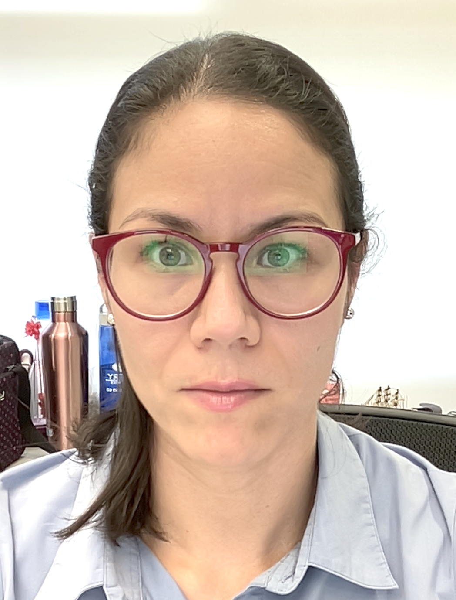

# Short Bio

I studied computer science for my bachelor's degree at the [Tecnológico Nacional campus in Los Mochis, Sinaloa](https://www.mochis.tecnm.mx/), México (2002-2006). I then obtained my master's degree in computer science, particularly Artificial Intelligence, at [CENIDET](https://www.cenidet.tecnm.mx/) (2007-2009). Finally, I got my PhD from [King Juan Carlos University](https://www.urjc.es/), campus Móstoles, in Spain (2009-2013). 
Currently, I have been working as a professor at the Research Center on Geospatial Information Sciences ([CentroGeo](https://www.centrogeo.org.mx/)) since 2014.

I was awarded the "Young Talent in Computer Sciences" prize by the [Mexican Academy of Computing](https://amexcomp.mx/) in 2024.
I am part of the National Research System (SNII) rank 1 (Mexico).
I teach data science, computer vision, computer programming, and machine learning.

Please go to my Google Scholar page to see all my publications [Google Scholar page](https://scholar.google.com/citations?user=SbtmwwsAAAAJ&hl=es)

# CONTACT  
Centro de investigación en ciencias de información geoespacial ([CentroGeo](https://www.centrogeo.org.mx/))
Circuito Tecnopolo Norte, No.107 Col. Tecnopolo Pocitos II, 20313 Aguascalientes, Ags.
Email. dmoctezuma[at]centrogeo[dot]edu[dot]mx

# Projects
-> Remote sensing image classification   
-> Identification of objects and people in smart video surveillance systems  
-> Explainable text classification models  
-> Classification of image and text using multimodal models  
-> Text classification problems (polarity, aggressivity, humor, etc.)  
